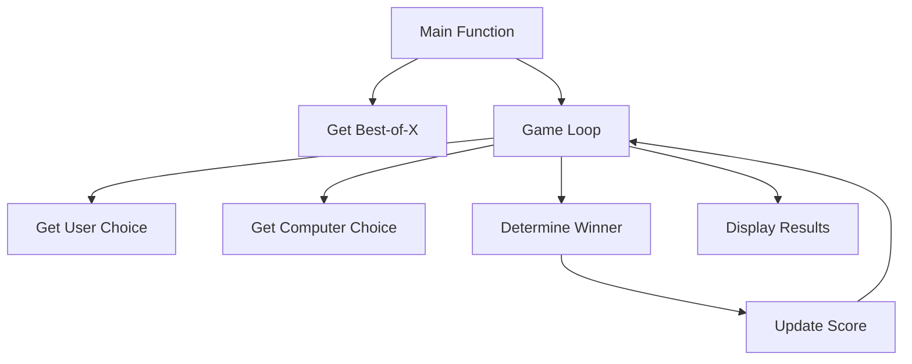

# Rock, Paper, Scissors Game Documentation

## Game Description

The Rock, Paper, Scissors game is a console-based C++ implementation of the classic hand game. Players compete against a computer opponent in a "best-of-X" format, where X is an odd number chosen by the player at the start (e.g., best of 3, 5, or 7). The game keeps track of scores throughout the session and declares a winner when either the player or computer reaches the majority of wins possible.

### Key Features

- Best-of-X format with user-defined number of games
- Real-time score tracking
- Input validation for all user interactions
- Random computer move generation
- Clear console-based user interface

## Algorithm Explanation

### Game Flow

1. **Initialization**:

   - Player inputs desired number of games (must be odd)
   - Required wins calculated as (X/2 + 1), where X is total games

2. **Main Game Loop**:

   - Continues until either player reaches required wins
   - Each round consists of:
     - Player choice input
     - Random computer choice generation
     - Winner determination
     - Score update

3. **Winner Determination Logic**:

```
if (player choice == computer choice)
    Result: Tie
else if ((player: Rock, computer: Scissors) OR
         (player: Paper, computer: Rock) OR
         (player: Scissors, computer: Paper))
    Result: Player Wins
else
    Result: Computer Wins
```

### Randomization

The game uses C++'s random number generator (seeded with current time) to ensure unpredictable computer moves:

- `srand(time(0))` initializes the random seed
- `rand() % 3 + 1` generates numbers 1-3 for computer choices

## Code Overview

### Program Structure

The program is organized into several key functions, each handling specific responsibilities:

1. **Main Game Control**

   - `main()`: Controls game flow and main loop
   - `getBestOfNumber()`: Handles initial game setup

2. **Game Logic Functions**

   - `getUserChoice()`: Handles player input (1-3)
   - `getComputerChoice()`: Generates computer moves
   - `determineWinner()`: Implements game rules
   - `convertChoiceToString()`: Converts numeric choices to text

3. **Display and Utility Functions**
   - `displayScore()`: Shows current game status
   - `clearInputBuffer()`: Handles input validation

### Component Interaction



### Error Handling

The program implements robust error handling:

- Validates odd number input for game count
- Ensures valid player moves (1-3 only)
- Handles invalid input without crashing
- Clears input buffer after invalid entries

### Memory Management

The program uses simple data types and stack-based variables, requiring no manual memory management. This design choice ensures memory safety and prevents memory leaks.

## Future Improvements

Potential enhancements could include:

1. Adding a persistent high score system
2. Implementing a graphical user interface
3. Adding multiplayer support
4. Including game statistics (move patterns, win percentages)
